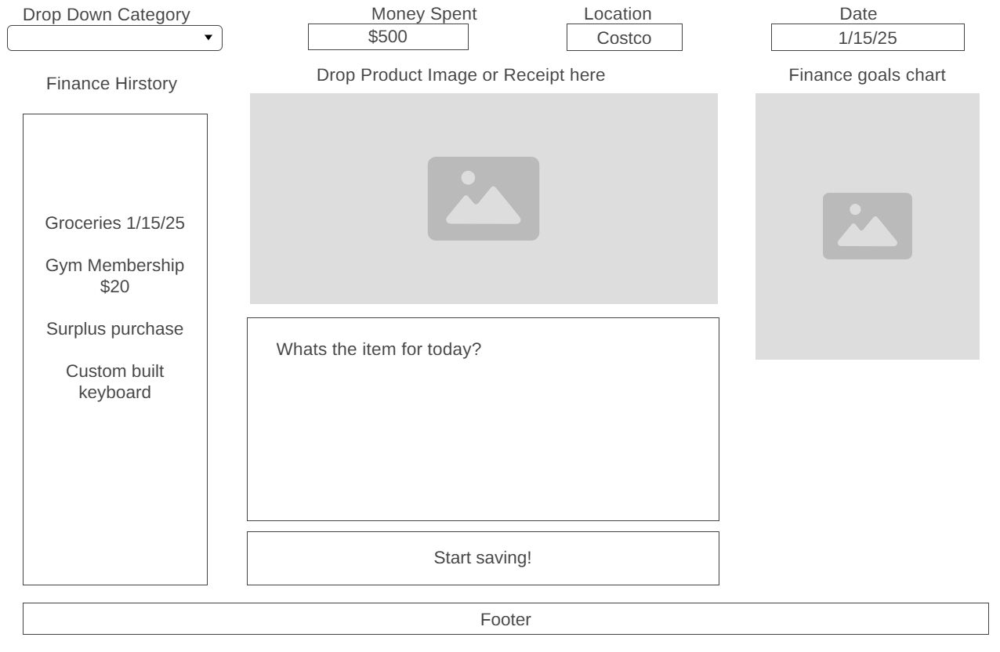

# SpendWiser Finance Tracker
## Problem Statement
- Limit spending habits
- Budget in a more controlled and easier enviorment
- View totals spent in an entire day/week
## Target Users
- Users who want to keep track of their finances
- Students managing limited budgets
- Young professionals who want to track their expenses and savings
- Freelancers with uncommon income
- Anyone who wants a simple simple finance tracking
## MVP
- Category functionality, (Food, Rent, Hobbies, Transport, etc)
- Input boxes for Date, Money spent, Description
- Image box for uploading images of the item~
## Extended Features
- Total spent
- Remaining balanace
- Transaction History (list view)
- Monthly summary dashboard
- pie chart for categories
## Core Entities
- Integers
- Strings
- Images
## Key Relationships
- Integers will be Dates, amount of money spent
- Strings will store the Description
- Images will be stored for easier identification
## User Flows
- Users can accomplish key tasks by keeping track and monitoring their spending.
## Wireframe

